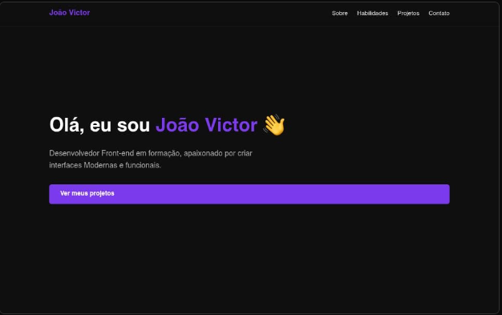

# 🗂️ Portfólio Pessoal — João Victor Cunha Torres



> Meu portfólio pessoal desenvolvido com HTML, CSS e JavaScript puro, apresentando minhas habilidades, projetos e formas de contato.

🔗 **[Acesse o portfólio online](https://meu-portfolio-psi-wine.vercel.app)**

---

## 📋 Sobre o projeto

Este portfólio foi desenvolvido como parte da minha jornada de aprendizado em desenvolvimento front-end. O objetivo foi construir uma página completa utilizando apenas as tecnologias base da web — sem frameworks — demonstrando domínio de HTML semântico, estilização com CSS e interatividade com JavaScript.

---

## ✨ Funcionalidades

- Navegação fixa com destaque dinâmico da seção ativa
- Seções: Apresentação, Sobre, Habilidades, Projetos e Contato
- Layout responsivo adaptado para diferentes tamanhos de tela
- Deploy contínuo via Vercel

---

## 🛠️ Tecnologias utilizadas


---

## 📁 Estrutura do projeto

```
meu-portfolio/
│
├── index.html       # Estrutura da página
├── style.css        # Estilização
├── script.js        # Interatividade
└── assets/
    └── preview.png  # Screenshot do projeto
```

---

## 🚀 Como rodar localmente

```bash
# Clone o repositório
git clone https://github.com/joaovictorctorres/meu-portfolio.git

# Entre na pasta
cd meu-portfolio

# Abra o arquivo index.html no navegador
# ou use a extensão Live Server no VSCode
```

---

## 📬 Contato

Feito por **João Victor Cunha Torres**

[](https://www.linkedin.com/in/jvictorctorres/)
[](https://github.com/joaovictorctorres)
[](mailto:contato.joaovct@gmail.com)
